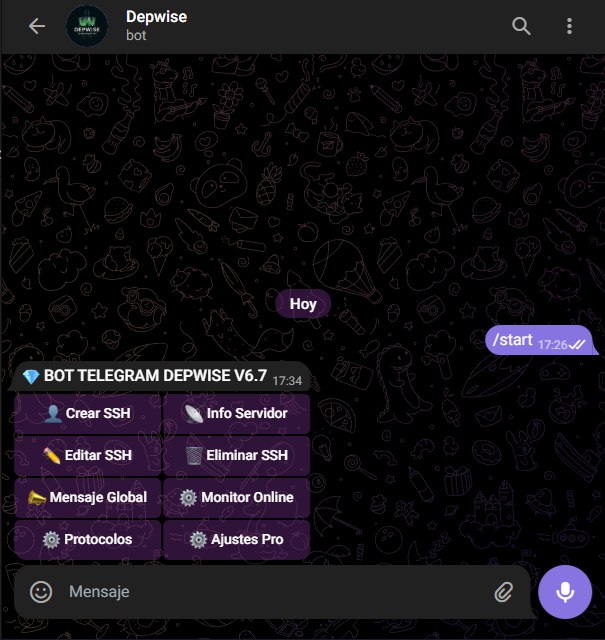

<div align="center">

# 💎 Bot Telegram Depwise SSH V6.7 (PRO)
### *La Solución Definitiva para Gestión de Redes Privadas*

[](https://github.com/Depwisescript)
[](https://www.python.org/)
[](https://www.gnu.org/software/bash/)
[](https://core.telegram.org/bots)

</div>

---

## 🚀 ¿Qué es Depwise Bot?

Un potente **Asistente Virtual** para administradores de servidores VPS. Gestiona usuarios SSH, protocolos VPN y monitorea tu red directamente desde Telegram con una interfaz **moderna, rápida y elegante**.

> [!NOTE]
> Diseñado para Ubuntu 20.04+ y Debian 10+. Compatible con arquitecturas AMD64 y ARM64.

---

## ✨ Novedades V6.7: Potencia y Estilo

### � Protocolo SSL Tunnel (HAProxy) [NUEVO]
¡Llevamos la seguridad al siguiente nivel! 
- **Integración Nativa**: Instala/Desinstala HAProxy con un clic.
- **Puerto Custom**: Define tu puerto de escucha SSL (ej: 443, 8443).
- **Helper Inteligente**: Gestión automática de firewall y liberación de puertos.

### 📱 Experiencia de Usuario (UX) Renovada
- **🧹 Chat Limpio**: El bot mantiene tu chat impecable borrando automáticamente mensajes de carga (2s) y errores (3s).
- **📋 Copiado Rápido**: IPs, Puertos, Usuarios y Claves ahora usan formato `<code>` para copiar con un solo toque.
- **☁️ Dominios Cloud**: Soporte total visual para dominios **Cloudflare** y **CloudFront** en los reportes.

---

## �️ Protocolos Soportados

| Protocolo | Estado | Descripción |
| :--- | :---: | :--- |
| **SSH Directo** | ✅ | Gestión completa de usuarios (Crear, Borrar, Renovar). |
| **SSL Tunnel** | ✅ | **NUEVO.** Túnel seguro vía HAProxy. |
| **SlowDNS** | ✅ | DNSTT integrado con gestión de claves. |
| **ZIVPN (UDP)** | ✅ | Soporte para videollamadas y juegos online. |
| **ProxyDT-Go** | ✅ | Versión Cracked Multi-arquitectura con WebSocket. |
| **BadVPN** | ✅ | UDPGW 7300 compilado para alto rendimiento. |

---

## � Instalación en 1 Paso

Copia y pega este comando en tu terminal **root**:

```bash
bash <(curl -Ls https://raw.githubusercontent.com/kevinaldaircama/bot-nefreet-/refs/heads/main/instalador_depwise.sh)
```

> [!IMPORTANT]
> El script instalará automáticamente todas las dependencias (Python, Pip, TMux, etc.) y te guiará paso a paso.

---

## 📸 Previas del Bot

<div align="center">
  
  <br>
  <i>Interfaz del Bot V6.7 (Captura Real)</i>
</div>

---

## ⚙️ Configuración Post-Instalación

1.  **Token del Bot**: Crea un bot en [@BotFather](https://t.me/BotFather) y obtén el API TOKEN.
2.  **ID Admin**: Consigue tu ID numérico en [@userinfobot](https://t.me/userinfobot).
3.  **Disfruta**: El bot se iniciará automáticamente y quedará residente en memoria.

---

<div align="center">

**Desarrollado con ❤️ por @KTT**
*Únete a la comunidad: @privanox_vpn*

</div>

